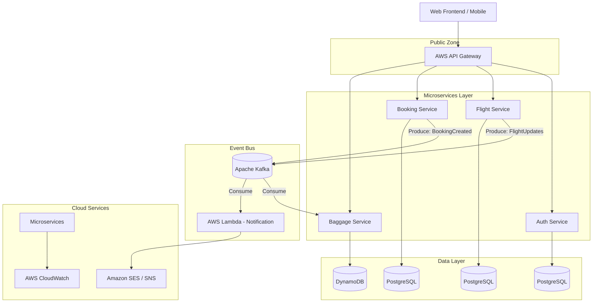
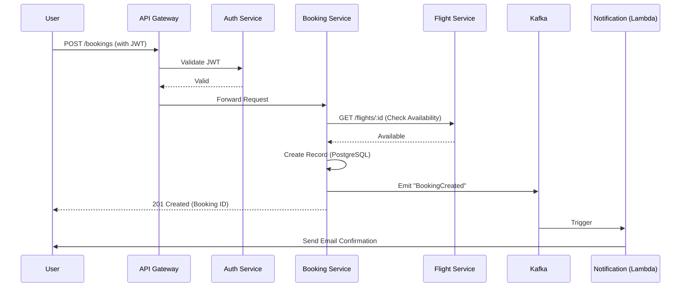
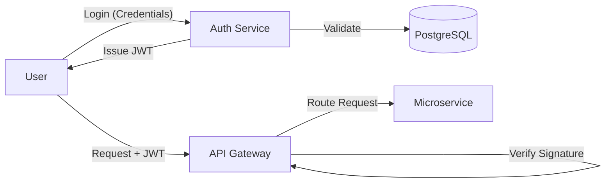

# Architectural Design - AeroLink Airline Systems Platform

This document provides the visual representation and explanation of the AeroLink cloud-native architecture.

## 1. System Architecture
The system is composed of loosely coupled microservices communicating synchronously via REST and asynchronously via Apache Kafka.

### High Availability & Scalability
- **Multi-Region**: The architecture can be deployed across multiple AWS regions using Route 53 for global DNS load balancing.
- **Auto-Scaling**: Microservices in Elastic Beanstalk automatically scale based on CPU/Memory usage.
- **Fault Tolerance**: Kafka acts as a buffer, ensuring that even if the Notification service is down, events are not lost.

---

## 2. Data Flow: Booking Process
This diagram illustrates the sequence of events when a passenger books a flight.

---

## 3. Security Model
AeroLink implements a robust security model using OAuth 2.0 principles and JWT.

### Compliance Strategy
- **Encryption in Transit**: All communication is secured via TLS/SSL (HTTPS).
- **Encryption at Rest**: AWS RDS and DynamoDB use AWS KMS for disk encryption.
- **GDPR**: User data is isolated in the Auth Service; implement "Right to be Forgotten" by cascading deletes.
- **PCI DSS**: Payment processing should be handled by a third-party provider (e.g., Stripe) to avoid storing credit card data directly.
